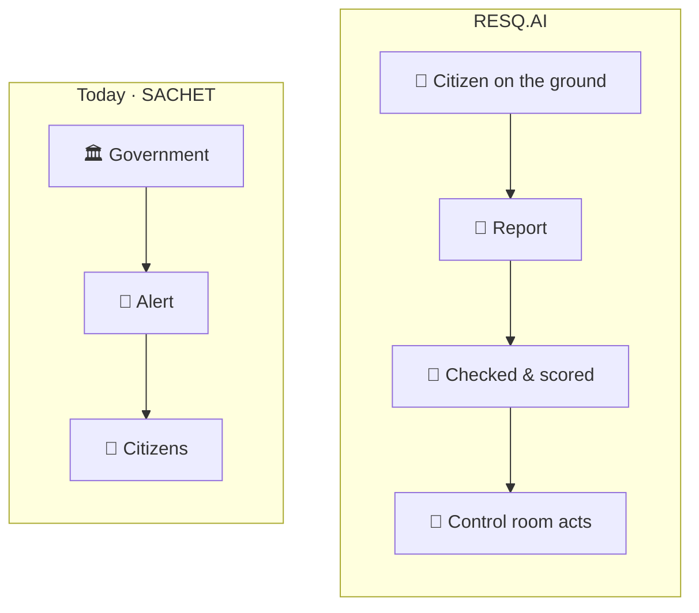
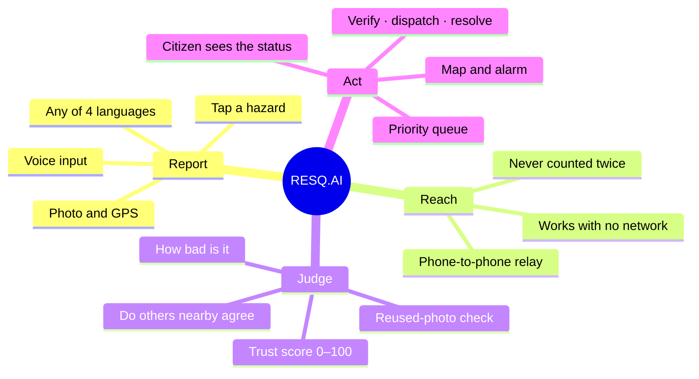
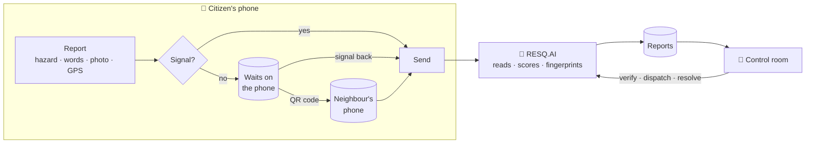
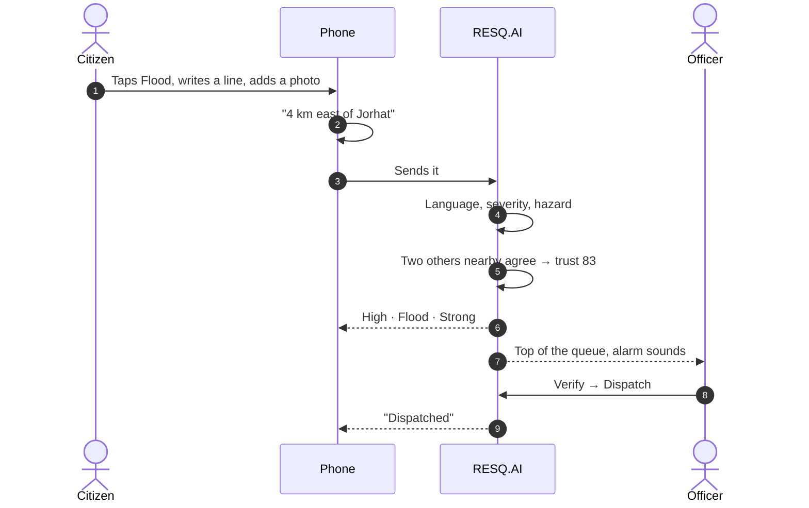
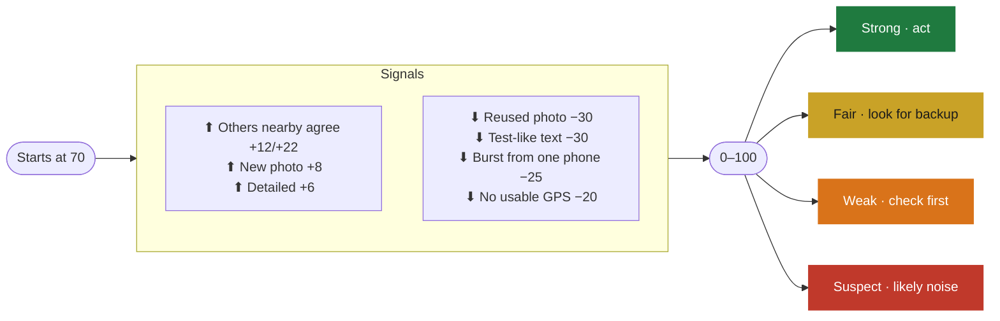
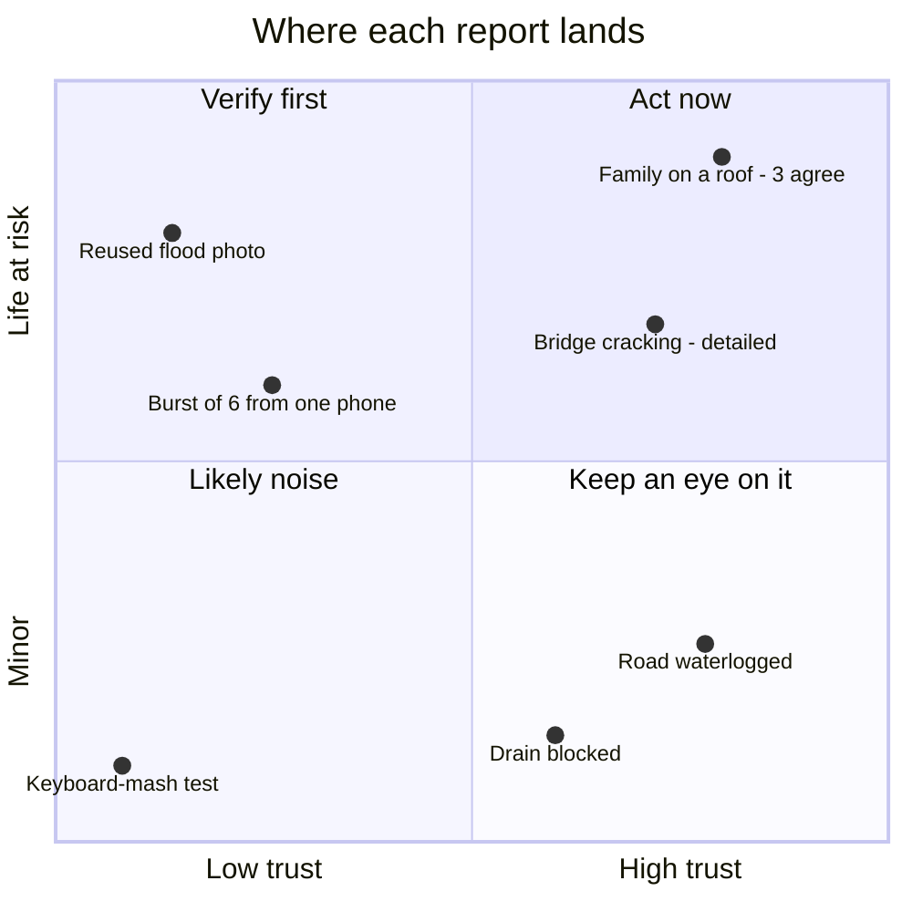
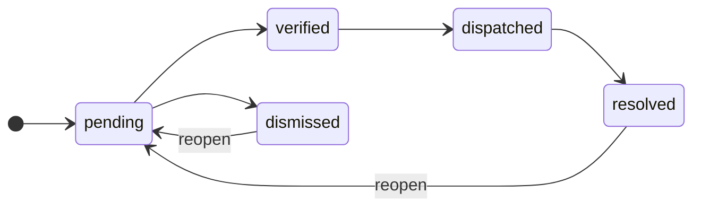
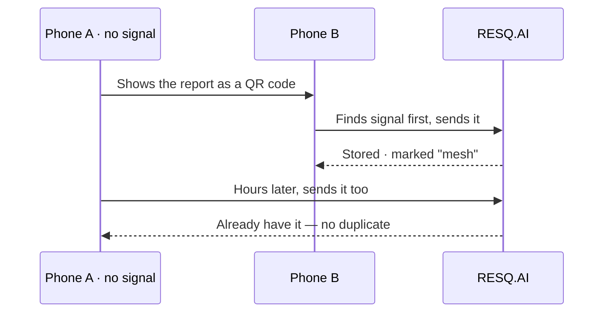

# RESQ.AI

**Citizens report disasters up. The control room sees them first.**

<!-- Screenshots go here:

  
  

-->

 

When a flood hits, the government already has a way to warn people. What it doesn't have is a way to **hear back** — from the family on the roof, the road that just went under, the embankment that broke ten minutes ago.

RESQ.AI is that way back.

Anyone caught in a disaster can report what they see — a flooded road, a collapsed wall, people trapped — in English and more , with a photo and their location. Every report is read, sorted by how serious it is, and given a trust score before it reaches a live control room, where officers see the most urgent, most believable reports first and can verify, dispatch and resolve them. And because disasters take networks down, a report waits on the phone until there's signal, or hops to a neighbour's phone that has it.

 

## The whole thing in one picture

Four verbs. Everything RESQ.AI does is one of them.

 

## How a report travels

<b>Zoom in on a single report</b>

 

 

## Can you trust a stranger's report?

That's the first question any officer asks. So every report gets a **trust score** before anyone sees it — with the reasons shown.

A reused photo gets caught even after it's been resized or recompressed. Five reports from one phone in ten minutes get flagged. Three people within 5 km saying the same thing push a report to the top.

Severity says how bad. Trust says how sure. Together they tell an officer where to look first.

<b>Every signal and its weight</b>

 

| Signal | Points |
|---|---:|
| 3+ other reports within 5 km, last 6 h | **+22** |
| 1–2 other reports within 5 km, last 6 h | **+12** |
| Photo never seen before | **+8** |
| Detailed description | **+6** |
| Relayed phone-to-phone | 0 |
| Photo couldn't be read | −3 |
| No photo | −5 |
| Too little detail | −15 |
| No usable coordinates · copy-pasted text | −20 |
| Burst from one phone · coordinates 0,0 | −25 |
| Reused photo · test-like text | −30 |
| Outside India | −35 |

Once it lands, an officer moves it along — and the citizen watches it happen on their own phone.

 

## When the network dies

Which, in a disaster, it will. The report waits on the phone — photo and all — and leaves the moment there's signal. Or it hops to a phone that has signal, by QR code.

The app itself opens with no network at all.

> [!IMPORTANT]
> This is a phone-to-phone relay, one hop at a time. A true Bluetooth mesh — phones finding each other and passing reports on by themselves — can't run in a web browser, and it's the first thing on the list below.

 

 

## What's next

- [x] Report in four languages, online or off
- [x] Phone-to-phone relay by QR code
- [x] Trust score with reasons, reused-photo detection
- [x] Live control room with map, alerts and actions
- [ ] True multi-hop mesh on Android (Bluetooth + Wi-Fi Direct)
- [ ] Individual officer accounts
- [ ] AI model classification switched on
- [ ] SMS alerts to responders
- [ ] More languages

 

On the one day the network works, RESQ.AI is a form. On every other day, it's how the message gets out.

